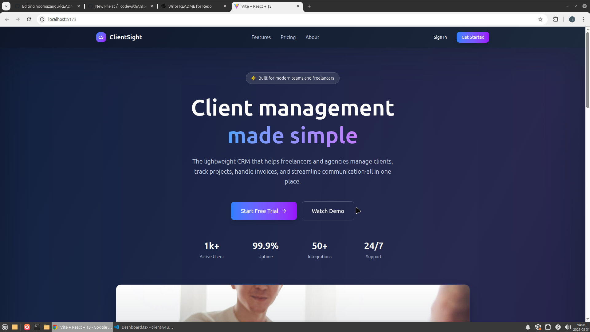
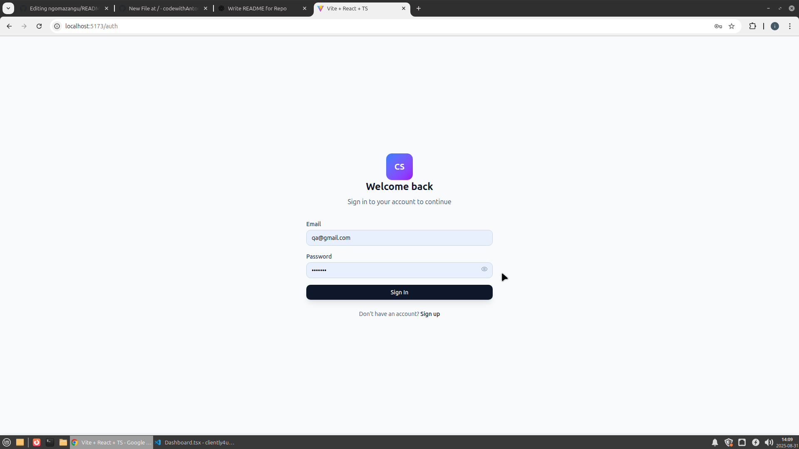
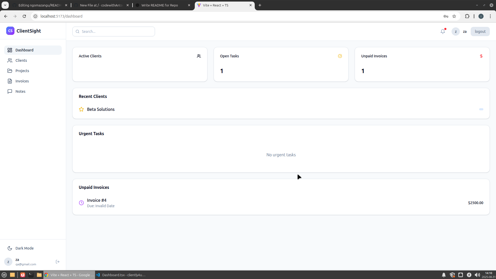

# ClientSight – Client Management Dashboard  

[](https://github.com/codewithAntony/cliently4us)  

**ClientSight** is a **CRM-style dashboard** for managing clients, tasks, and activities. It’s built with **React, TypeScript, Go and TailwindCSS**, demonstrating practical frontend and backend skills in dynamic UI design, state management, and real-world data handling.  


---

## Features  

- **Client Management** – Add, view, and update client records.  
- **Task Tracking** – Assign, mark complete, and organize tasks.  
- **Activity Dashboard** – Visualize client activity and status.  
- **Responsive UI with TailwindCSS** – Modern, mobile-friendly design.  
- **React + TypeScript** – Type-safe, scalable frontend architecture.
- **Golang** - Type-safe and authentification. 

---

## Tech Stack  

- **Frontend:** React, TypeScript, TailwindCSS 
- **Backend:**  Golang
- **Database:** MySQL
- **Build Tool:** Vite 

---

## Screenshots  

### Homepage



### SignupPage



### Dashboard




---

## Getting Started  

### 1. Clone the Repository  
```bash

git clone https://github.com/codewithAntony/cliently4us.git

cd cliently4us

```
---

### 2. Install Dependencies 
```bash

npm install

```
---

### 5. Run the app
```bash

npm run dev

```
---

Your app will be running at:
``` http://localhost:5173 ``` (if using vite)

---

### Deployment

## Build for production
```bash

npm run build

```

This will generate a ``` /dist ``` folder with the optimized production build.

